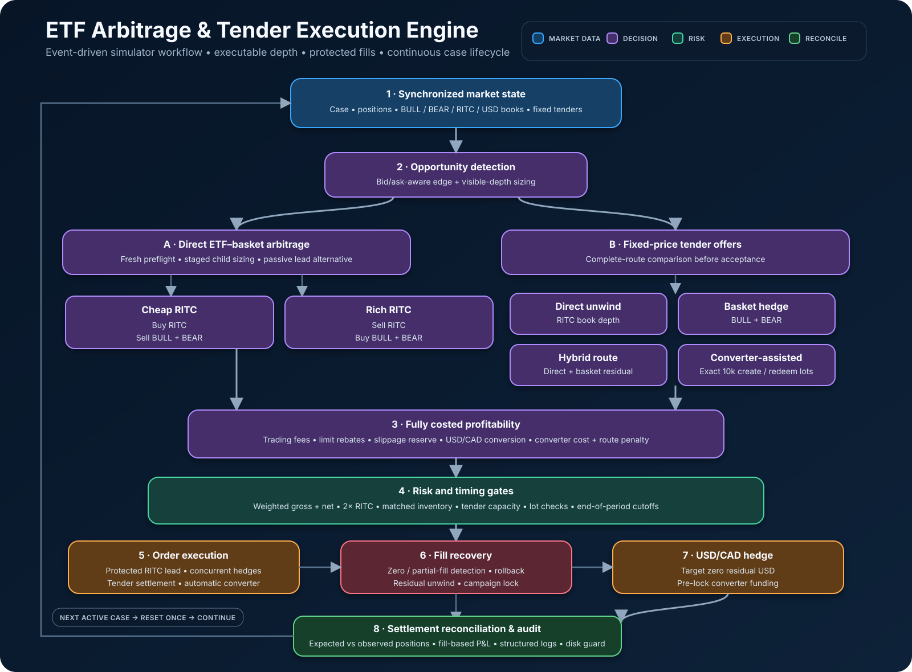
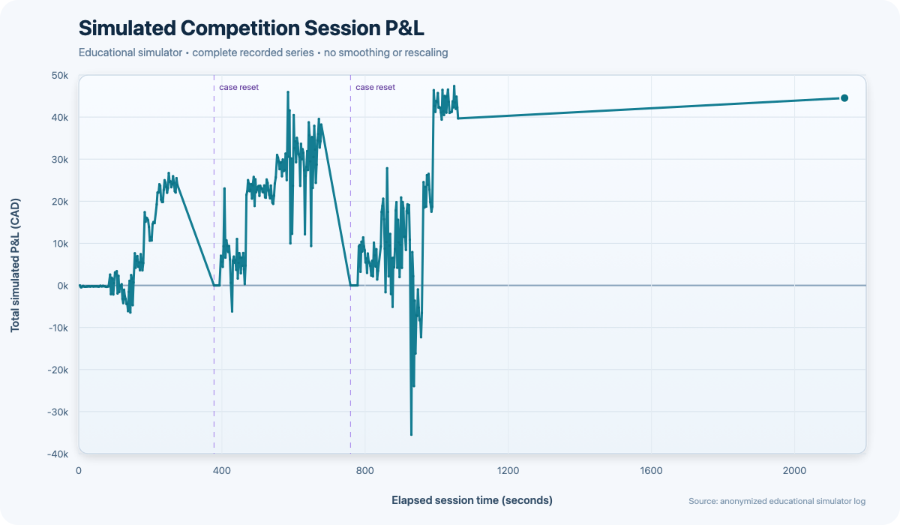

# RITC ETF Arbitrage Engine

An event-driven ETF arbitrage and tender-execution engine developed for an educational **RITC × MSCF market-simulation competition**. The project combines cross-currency relative-value detection, fixed-price tender routing, protected execution, local risk controls, automatic conversion, settlement reconciliation, and structured audit logging in one continuously running Python process.

> **Safe default:** `LIVE_TRADING = False`. Importing the module performs no network request, opens no browser, prompts for no credentials, and creates no log directory.



## Strategy at a glance

The simulated ETF relationship is approximately

\[
P_{RITC}^{USD}\times FX_{CAD/USD}\approx P_{BULL}^{CAD}+P_{BEAR}^{CAD}.
\]

Every decision uses executable bid/ask prices and visible depth rather than midpoint prices. Fees, the passive-limit rebate, FX conversion, slippage protection, and converter cost are included where the route requires them.

| Strategy | Entry condition | Execution sequence | Expected profit source | Main risks |
|---|---|---|---|---|
| Cheap-ETF direct arbitrage | The cost of buying RITC in USD and converting that cash to CAD, including fees, is below executable BULL + BEAR bids by the configured edge and total-P&L thresholds. | Buy RITC with a short-lived protected marketable limit; hedge only its actual fill by selling matched BULL and BEAR quantities; convert residual USD. | Convergence of the cross-currency ETF price to its basket value. | Lead-order non-fill, hedge slippage, leg mismatch, shallow FX depth, and open matched inventory. |
| Rich-ETF direct arbitrage | Executable RITC bid converted to CAD, net of fees, exceeds executable BULL + BEAR asks by the configured thresholds. | Sell RITC with a protected marketable limit; buy matched BULL and BEAR quantities; convert residual USD. | The same relative-value convergence in the opposite direction. | Borrow/sell execution, partial fills, adverse movement between legs, and FX execution. |
| Fixed-price tender | At least one complete route clears the minimum edge, risk-adjusted score, time gate, and transient risk checks. | Compare direct unwind, basket hedge, hybrid, and converter-assisted routes; accept only a fixed tender; wait for settlement; revalue; execute; reconcile positions; hedge FX. | Tender price improvement relative to executable liquidation or hedge economics. | Tender settlement lag, route decay, large transient exposure, converter delay/cost, and incomplete unwind. |
| Passive protected-limit arbitrage | A one-sided RITC limit can earn the rebate while leaving enough modeled edge to hedge a fill. | Rest a capped RITC limit briefly; cancel or detect its terminal state; hedge the frozen fill in BULL/BEAR; unwind any unmatched residual; convert USD. | Relative-value edge plus the simulated limit rebate. | Queue uncertainty, cancellation races, partial fills, and immediate hedge slippage. |

## Tender route comparison

For each fixed-price offer, the engine evaluates complete executable alternatives and chooses the highest eligible risk-adjusted score:

- **Direct RITC unwind:** accept the tender, then liquidate the resulting RITC position through visible RITC depth.
- **BULL/BEAR basket hedge:** offset the tender exposure with equal BULL and BEAR quantities, retaining matched relative-value inventory.
- **Hybrid route:** directly unwind the portion supported by attractive RITC depth and basket-hedge the residual. Only the basket residual receives the hold/time penalty.
- **Converter-assisted route:** combine direct RITC depth with exact 10,000-share converter lots. The route includes basket execution, USD/CAD conversion, the fixed converter charge, and a converter execution-risk penalty.

The converter is selected only when its **net route score** remains superior after all modeled costs and when its direction, lot size, time, position, and transient-risk checks pass. If existing matched inventory blocks an otherwise profitable tender, V13 may first convert a tightly capped number of existing lots to release capacity, then re-fetch and re-evaluate the same tender.

## Risk and execution controls

### Weighted exposure

For positions \(q_B, q_{BR}, q_R\) in BULL, BEAR, and RITC:

\[
G=|q_B|+|q_{BR}|+2|q_R|,
\qquad
N=q_B+q_{BR}+2q_R.
\]

RITC receives a **2× position multiplier** because one RITC share is matched by one share of each basket component; the multiplier puts its limit consumption on the same two-leg basis as BULL + BEAR. The engine checks projected weighted gross and absolute weighted net before direct trades and after every planned tender step. A trade above the ordinary gross cap may proceed only when it strictly reduces gross risk, does not worsen absolute net exposure, and brings net exposure within its configured cap.

### Inventory and capacity

- The selected V13 scale stage caps ordinary direct actions at 10,000 shares and coherent matched arbitrage inventory at 40,000 shares.
- Local ordinary limits are weighted gross 220,000 and absolute weighted net 25,000; separate transient tender caps cover the tender-before-hedge sequence.
- Tender capacity checks apply first to acceptance, then incrementally to each intended hedge leg—not only to the final portfolio.
- Direct sizing walks synchronized BULL, BEAR, RITC, and USD/CAD depth, rounds to the configured quantity step, and scales down until risk and matched-inventory caps pass.

### Execution safety

- **Concurrent data collection:** the fast path requests case state, positions, books, and tenders concurrently, with a sequential fallback on API failure.
- **Fresh direct preflight:** every direct signal is re-priced immediately before execution; large opportunities are split into independently revalued 2,500-share child slices.
- **Protected lead order:** RITC is the lead leg and is submitted as a short-lived marketable limit that reserves minimum realized edge and basket slippage capacity.
- **Partial-fill detection:** order status, filled quantity, VWAP, and—in cancellation races—position changes determine the quantity that can safely be hedged.
- **Failed-leg rollback:** earlier excess fills are reversed toward the smallest completed leg. Any unresolved exposure is logged as critical.
- **Settlement barrier:** after a tender is accepted, unrelated trading and FX are locked until the RITC position settles. The route is then revalued from settled positions.
- **Reconciliation:** expected stock positions are compared with observed positions after the hedge; FX conversion waits until reconciliation or a logged stable simulator state.
- **Continuous USD/CAD hedging:** RITC cash flows create USD balances. The normal target is zero residual USD; positive USD is sold and negative USD is bought, subject to the trigger/band and end-of-case gate. Converter campaigns first lock the exact USD funding they require.
- **End-of-period gates:** new passive quotes, new direct inventory, all direct execution, tender routes, and finally every new order stop at progressively tighter time thresholds.

## Operational design

The engine supports continuous multi-case execution. The main loop keeps `has_been_active` true throughout one active case. It resets tender de-duplication, direct confirmation, pending tender/converter objects, passive-order state, and per-case counters exactly once when the next case transitions to `ACTIVE`; observing `STOPPED` re-arms that transition logic for the following case.

Structured run output includes market snapshots, action-level decisions, simulator P&L, parameters, startup limits, and a final summary. Forecast P&L is kept separate from exact-fill P&L. Exact-fill reconciliation requires the requested quantity to match aggregated fills; zero or partial quantities cannot create a fabricated VWAP. Full-depth logging is optional and disables itself if free disk space falls below the configured reserve, allowing the trading loop to continue.

## Installation

Python 3.10+ is recommended.

```bash
git clone <repository-url>
cd ritc-etf-arbitrage-engine
python -m venv .venv
source .venv/bin/activate
python -m pip install -r requirements.txt
```

`requests` is the only trading runtime package; `pytest` is included for the offline safety suite.

## Configuration

The engine deliberately does not load `.env` files itself. Export values from a private shell session or use your preferred secret manager. `config/example.env` contains placeholders only.

| Variable | Purpose |
|---|---|
| `RIT_DMA_ENDPOINT` | Full DMA base URL ending in `/v1`. No server address is embedded in the public source. |
| `RIT_DMA_USERNAME` | Simulator Trader ID. If omitted, the executable prompts at startup. |
| `RIT_DMA_PASSWORD` | Simulator password. If omitted, the executable uses a hidden password prompt. |

Example shell setup:

```bash
export RIT_DMA_ENDPOINT="https://your-simulator-host.example/v1"
export RIT_DMA_USERNAME="your_trader_id"
export RIT_DMA_PASSWORD="your_password"
```

Never commit a populated `.env` file. Strategy parameters remain grouped near the top of `src/etf_arbitrage_engine.py`; V13's thresholds, scale stage, tender settings, converter settings, and risk limits are preserved.

## Dry-run operation

With the committed `LIVE_TRADING = False`, the engine connects to the configured simulator, reads market state, evaluates opportunities, and writes local audit logs, but order and tender submission methods return dry-run outcomes.

```bash
python src/etf_arbitrage_engine.py
```

Dry run still requires access to the educational simulator because it evaluates live simulator data. Pure imports and the test suite require no credentials or network connection.

## Explicitly enabling simulator execution

Live simulator execution is intentionally a source-level opt-in:

1. Confirm the simulator is the educational environment and export the three connection variables above.
2. Review the simulator's current `/limits` values and confirm the local weighted limits do not exceed them.
3. In `src/etf_arbitrage_engine.py`, change only `LIVE_TRADING = False` to `LIVE_TRADING = True` and leave `RISK_LIMITS_CONFIRMED = True` only after that review.
4. Run the script from a clean terminal and verify the startup report says `MODE=LIVE` before the case becomes active.

Both live controls are checked before startup. The engine refuses live operation if limits cannot be verified.

## Testing

The suite is entirely offline and uses synthetic objects or local source inspection; it does not contact the simulator.

```bash
python -m py_compile src/etf_arbitrage_engine.py
python -m pytest -q
```

Coverage includes zero-fill and exact-fill VWAP behavior, partial-fill rejection, weighted gross/net exposure, risk-reducing trades, converter lot size and cost, FX direction, import safety, and the once-per-activation case reset guard.

## Results

Development evidence from the educational simulator showed that fixed-price tenders became the primary P&L driver, while direct arbitrage added smaller, more frequent opportunities. Converter routes were evaluated only after their fixed charge, and partial fills, settlement delays, and open inventory made displayed simulator P&L volatile. Forecast route P&L and fill-based P&L also diverged as books moved during execution.

The team-reported competition outcome was **approximately top 15 / top 10% among roughly 150 participating teams**. This is an approximate result from an educational simulated competition, not audited live-trading performance. The included chart is an anonymized, unaltered time-series view of one complete recorded simulator session; account identifiers, positions, books, orders, and timestamps were excluded.



See [docs/results.md](docs/results.md) for interpretation and provenance limitations.

## Repository structure

```text
ritc-etf-arbitrage-engine/
├── README.md
├── LICENSE
├── .gitignore
├── requirements.txt
├── src/
│   └── etf_arbitrage_engine.py
├── tests/
│   └── test_execution_safety.py
├── config/
│   └── example.env
├── docs/
│   ├── strategy.md
│   ├── architecture.md
│   └── results.md
├── examples/
│   ├── sample_parameters.json
│   ├── sample_actions.csv
│   └── sample_pnl.csv
└── assets/
    ├── strategy_logic.svg
    ├── strategy_logic.png
    └── pnl_curve.png
```

Historical V1–V12 scripts, duplicate V13 files, raw run logs, full order books, archives, competition PDFs/webpages, and private configuration are intentionally excluded. Future revisions belong in Git history rather than numbered copies.

## Limitations

- Built against an educational DMA simulator API, not a broker production API.
- Visible depth can disappear before execution; modeled edge is not guaranteed realized P&L.
- Marketable-limit protection reduces lead-leg price risk but cannot eliminate hedge slippage or partial-fill exposure.
- Tender and converter settlement are simulator-specific and require revalidation if the API or case mechanics change.
- The local dashboard is disabled by default; it starts only from `main()` when explicitly enabled.
- No claim is made that the strategy, controls, or results transfer to live financial markets.

## Disclaimer

This project was developed for an educational market-simulation
competition. It is not investment advice and is not designed for deployment
in real financial markets without substantial additional testing, controls,
and broker-specific integration.
