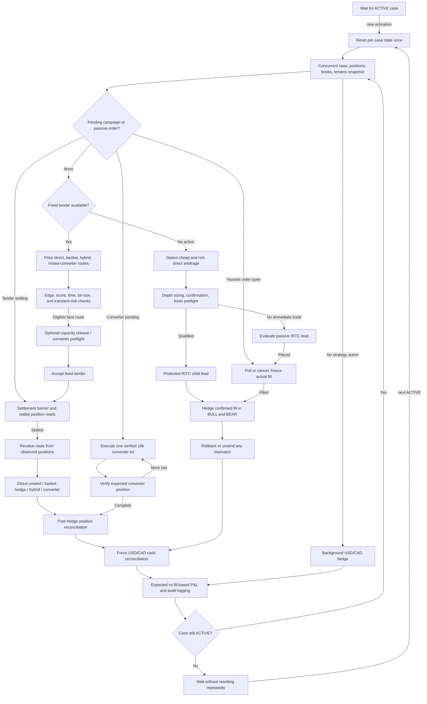

# Architecture

## Runtime components

The repository intentionally keeps the competition implementation in one executable module. The major components are separated by functions and state objects rather than packages:

1. **DMA client and market-state collection** — authenticated API access, retries, order/tender methods, converter discovery, and concurrent snapshot collection.
2. **Order-book model** — `Book`, `Level`, and `DepthCursor` represent executable bid/ask depth. `MarketState` binds books, positions, case status, and time remaining.
3. **Signal and candidate generation** — direct, passive, tender, hybrid, and converter evaluators return `Candidate` objects with quantities, legs, accounting P&L, route score, and metadata.
4. **Risk validation** — weighted gross/net projection, matched-inventory capacity, tender transient checks, end-of-period gates, and inventory-reduction exceptions.
5. **Execution** — protected RITC lead orders, concurrent or matched hedges, chunked orders, rollback, fixed-tender acceptance, and converter use.
6. **Campaign state** — `PendingTenderExecution`, pending converter records, passive-order state, and direct confirmation tracking prevent overlapping workflows.
7. **Reconciliation and audit** — exact-fill VWAP/P&L, position barriers, USD/CAD reconciliation, CSV/JSON summaries, dashboard state, and disk-space safeguards.

## Source-matched flow

## State transitions

### Case lifecycle

`has_been_active` is false while waiting. The first observed `ACTIVE` status sets it true and clears per-case tender de-duplication, direct confirmation, action tick, P&L endpoint status, error count, converter-tender count, and every pending campaign/passive-order object. It stays true throughout the active loop, so the reset block cannot repeat. A non-active state sets it false and returns to waiting; the next active transition receives one fresh reset. `EXIT_AFTER_ACTIVE_PERIOD` can instead end the process.

### Direct execution

The initial candidate is a signal, not authority to trade. A fresh concurrent preflight re-prices the same direction. Each child is valued again, the protected RITC limit is submitted, and only its resolved fill becomes the hedge target. A short hedge becomes an immediate RITC residual unwind. Exact-fill P&L reconciliation runs only for complete BULL/BEAR/RITC quantities with a matching USD conversion.

### Tender campaign

Tender evaluation permits only fixed-price offers. After acceptance, `PendingTenderExecution` locks unrelated strategy actions. The engine waits for the expected RITC position across stable reads, then revalues the route. Direct, basket, and hybrid paths reconcile expected stock positions before FX. A persistent unexpected but stable simulator state is logged and treated as authoritative before the lock is released.

### Converter campaign

Converter routes discover the exact case asset, verify or obtain its lease, pre-lock required USD funding, and process one 10,000-share lot at a time. Expected BULL, BEAR, RITC, and USD position changes are verified after each use. Failed confirmation keeps the campaign unresolved and visible in audit state. P&L reconciliation can continue asynchronously after positions settle.

### Logging and disk protection

`AuditLogger` is created only inside `main()`, so import is side-effect free. It records reduced market snapshots, action events, P&L, configuration, limits, and summary data. Full-book depth is off by default. When enabled, a periodic free-space check closes and disables that stream below the reserve rather than terminating trading.
